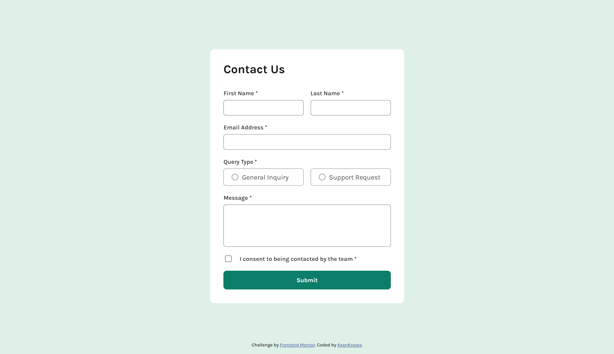
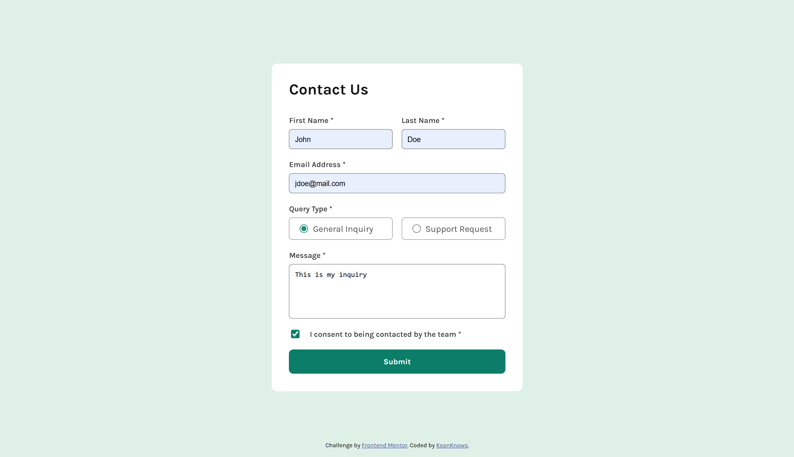
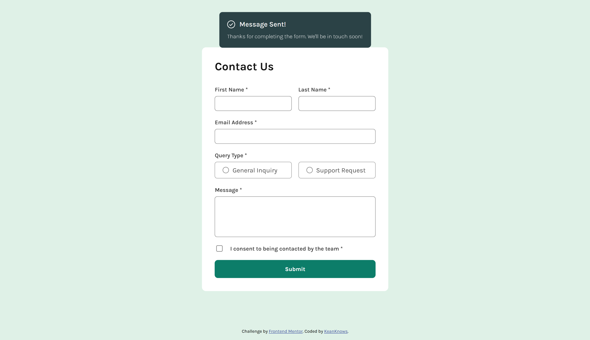
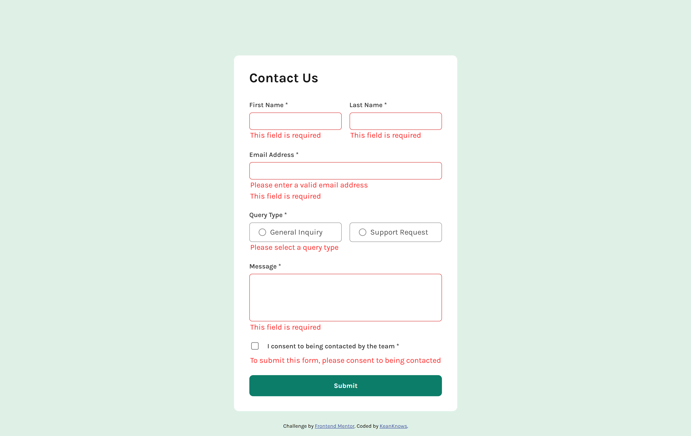

# Frontend Mentor - Contact form solution

This is a solution to the [Contact form challenge on Frontend Mentor](https://www.frontendmentor.io/challenges/contact-form--G-hYlqKJj). Frontend Mentor challenges help you improve your coding skills by building realistic projects.

## Table of contents

- [Overview](#overview)
  - [The challenge](#the-challenge)
  - [Screenshot](#screenshot)
  - [Links](#links)
- [My process](#my-process)
  - [Built with](#built-with)
  - [What I learned](#what-i-learned)
  - [Continued development](#continued-development)
- [Author](#author)

## Overview

### The challenge

Users should be able to:

- Complete the form and see a success toast message upon successful submission
- Receive form validation messages if:
  - A required field has been missed
  - The email address is not formatted correctly
- Complete the form only using their keyboard
- Have inputs, error messages, and the success message announced on their screen reader
- View the optimal layout for the interface depending on their device's screen size
- See hover and focus states for all interactive elements on the page

### Screenshot






### Links

- Solution URL: [Frontend Mentor Solution](https://www.frontendmentor.io/solutions/my-contact-form-nwRpz4wqv9)
- Live Site URL: [Contact Form via GitHub Pages](https://keanknowsss.github.io/Contact-Form-Component-Solution/) (may not be available, you may just clone this to test it locally)

## My process

### Built with

- Semantic HTML5 markup
- CSS 
- Flexbox
- ARIA
- Vanilla Javascript
- Desktop-first workflow

### What I learned

It is easy to create a form, but we always tend to forget to make it accessible to all users. Towards the end I had to research the **ARIA**. 

Example:
```html
<p aria-hidden="true" >Error!</p>
```
```html
<p aria-hidden="true" role="dialog" >Success!</p>
```
This can be seen in the form fields, error messages, and success message.

### Continued development

This can be part of a reusable component library in the future...

## Author

- GitHub - [keanknowsss](https://github.com/keanknowsss)
- Frontend Mentor - [@keanknowsss](https://www.frontendmentor.io/profile/keanknowsss)
- LinkedIn - [Keanu Dwight Solomon](https://www.linkedin.com/in/keanu-dwight-solomon/)